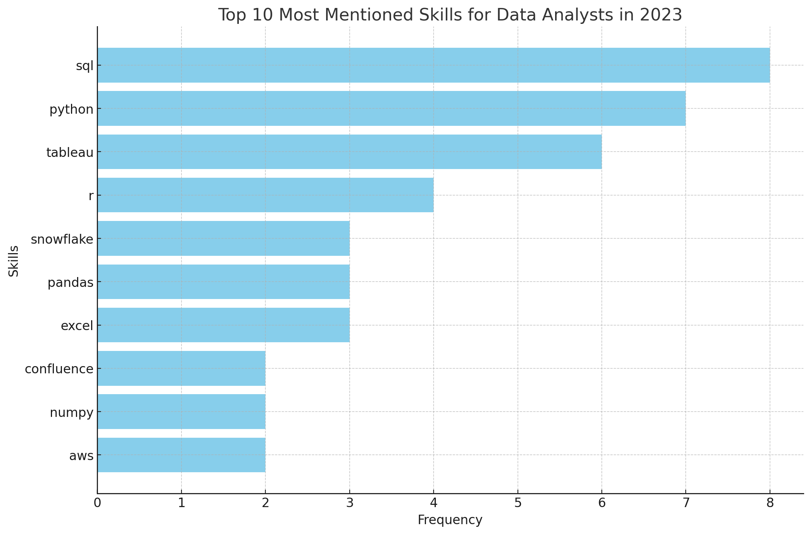

# Introduction


📊 Exploring the Data Job Market
This project analyses data analyst roles, uncovering top-paying jobs, high-demand skills, and where lucrative opportunities meet industry needs.

🔎 SQL Queries here: 
[project_sql folder](/project_sql/)

# Background
This project stems from the need to better understand the data analyst job market. By identifying top-paying roles and in-demand skills, it aims to provide a streamlined approach for finding optimal career opportunities.

Data hails from the [SQL Course](https://www.lukebarousse.com/sql). It consists of insights on job titles, salaries, locations, and essential skills.

### The questions I wanted to answer were:

1. What are the highest-paying data analyst jobs?
2. What skils are required for these top-paying jobs?
3. Which skills are most in demand?
4. Which skills are associated with the highest salaries?
5. What are the most strategic skills to learn for optimal career growth?

# Tools I Used

- **SQL:** The primary tool for querying and analyzing the database.
- PostgreSQL: The chosen database management system, ideal for handling the job posting data.
- Visual Studio Code:  Used for database management and executing SQL queries.
- Git & GitHub: For version control, collaboration, and project tracking.

# The Analysis
Each query for this project aimed at investigating specific aspects of the data analyst job market.
Here's how I approached each question:

### 1. Top Paying Data Analyst Jobs
To identify the highest-paying roles, I filtered data analyst positions by average yearly salary and location, focusing on remote jobs. This query highlights the high paying opportunities in the field.

```sql
SELECT
    job_id,
    job_title,
    job_location,
    job_schedule_type,
    salary_year_avg,
    job_posted_date,
    name AS company_name
FROM    
    job_postings_fact
LEFT JOIN company_dim ON job_postings_fact.company_id = company_dim.company_id
WHERE
    job_title_short = 'Data Analyst' AND
    job_location = 'Anywhere' AND
    salary_year_avg IS NOT NULL
ORDER BY
    salary_year_avg DESC
LIMIT 10
```
•	Key Insights:

-**Wide Salary Range:** Salaries range from $184,000 to $650,000 indicating significant salary potential in the field.  
-**Diverse Employers:** Companies like Meta, AT&T, and SmartAsset lead the list.  
-**Job Title Variety:** There's a high diversity in job titles, from Data Analyst to Director of Analytics, reflecting varied roles and specialisations within data analytics.  


### 2. Top Paying Skills
To understand what skills are required for top paying jobs, I joined to job postings with the skills data, providing insights into what employers value for high-compensation roles.

```
  WITH top_paying_jobs AS (
    SELECT
        job_id,
        job_title,
        salary_year_avg,
        name AS company_name
    FROM    
        job_postings_fact
    LEFT JOIN company_dim ON job_postings_fact.company_id = company_dim.company_id
    WHERE
        job_title_short = 'Data Analyst' AND
        job_location = 'Anywhere' AND
        salary_year_avg IS NOT NULL
)

SELECT
    top_paying_jobs.*,
    skills_dim.skills
FROM top_paying_jobs
INNER JOIN skills_job_dim ON top_paying_jobs.job_id = skills_job_dim.job_id
INNER JOIN skills_dim ON skills_job_dim.skill_id = skills_dim.skill_id
ORDER BY    
    salary_year_avg DESC
LIMIT 10;
```

Here's the breakdown for the top 10 Most mentioned skills for data analyst jobs in 2023:

•SQL: The most frequently mentioned skill with 8 mentions, essential for managing and querying databases.  
•Python: Highly demanded with 7 mentions for its versatility in data analysis, machine learning, and scripting.  
•Tableau: A key tool for data visualization with 6 mentions, crucial for presenting data insights effectively.  
•Other skills such as R, Snowflake, and Excel show varying degrees of demand.  


*Bar graph visualising the most mentioned skills for data analysts. ChatGPT generated this graphs from my query results*

### 3. In-Demand Skills For Data Analysts

This query helped identify the skills most frequently requested in job postings, directing focus to areas with high demand

```
SELECT
    skills,
    COUNT(skills_job_dim.job_id) AS demand_count
FROM job_postings_fact
INNER JOIN skills_job_dim ON job_postings_fact.job_id = skills_job_dim.job_id
INNER JOIN skills_dim ON skills_job_dim.skill_id = skills_dim.skill_id
WHERE
    job_title_short = 'Data Analyst'
GROUP BY
    skills
ORDER BY
    demand_count DESC
LIMIT 5;
```

Here's the breakdown of the most demanded skills for data analysts in 2023.

•SQL: The most in-demand skill with 92,628 mentions, highlighting its critical role in database management and querying.  
•Excel: Highly valued with 67,031 mentions, emphasizing its importance in data organization, analysis, and reporting.  
•Python: With 57,326 mentions, Python is essential for data analysis, automation, and machine learning.  
•Tableau: Garnering 46,554 mentions, Tableau is a key tool for data visualization and storytelling.  
•Power BI: With 39,468 mentions, Power BI is crucial for creating interactive and business-focused data visualizations.  

| Skills    | Demand Count |
|-----------|--------------|
| SQL       | 92,628       |
| Excel     | 67,031       |
| Python    | 57,326       |
| Tableau   | 46,554       |
| Power BI  | 39,468       |

Table of the demand for the top 5 skills in data analyst job openings

### 4. Skills Based on Salary

Exploring the average salaries associated with different skills revealed which skills are the highest paying.

```
SELECT
    skills,
    ROUND(AVG(salary_year_avg),0) AS avg_salary
FROM job_postings_fact
INNER JOIN skills_job_dim ON job_postings_fact.job_id = skills_job_dim.job_id
INNER JOIN skills_dim ON skills_job_dim.skill_id = skills_dim.skill_id
WHERE
    job_title_short = 'Data Analyst'
    AND salary_year_avg IS NOT NULL
    --AND job_work_from_home = True
GROUP BY
    skills
ORDER BY
    avg_salary
LIMIT 25;
```
Here's a breakdown of the results for top paying skills for Data Analysts:

•Big Data and Data Processing: Tools like PySpark ($208,172) and Databricks ($141,907) offer the highest salaries, highlighting the importance of big data expertise.  
•Version Control and Collaboration: Skills in tools like Bitbucket ($189,155) and GitLab ($154,500) are highly valued for managing code and teamwork.  
•Machine Learning and AI: Proficiency in AI tools like Watson ($160,515) and machine learning libraries like Scikit-learn ($125,781) is crucial for top-paying roles.  

| Skills         | Average Salary (USD) |
|----------------|----------------------|
| PySpark        | $208,172             |
| Bitbucket      | $189,155             |
| Couchbase      | $160,515             |
| Watson         | $160,515             |
| DataRobot      | $155,486             |
| GitLab         | $154,500             |
| Swift          | $153,750             |
| Jupyter        | $152,777             |
| Pandas         | $151,821             |
| Elasticsearch  | $145,000             |

Table of the average salary for the top 10 paying skills for data analysts

### 5.Most Optimal Skills to Learn

Combining strategic insights from demand and salary data, this query aimed to pinpoint skills that are both in high demand and have high salaries, offering a strategic focus for skill development.

```
SELECT
    skills_dim.skill_id,
    skills_dim.skills,
    COUNT(skills_job_dim.job_id) AS demand_count,
    ROUND(AVG(job_postings_fact.salary_year_avg), 0) AS avg_salary
FROM job_postings_fact
INNER JOIN skills_job_dim ON job_postings_fact.job_id = skills_job_dim.job_id
INNER JOIN skills_dim ON skills_job_dim.skill_id = skills_dim.skill_id
WHERE
    job_title_short = 'Data Analyst'
    AND salary_year_avg IS NOT NULL
    AND job_work_from_home = TRUE
GROUP BY
    skills_dim.skill_id
HAVING
    COUNT(skills_job_dim.job_id) > 10
ORDER BY
    avg_salary DESC,
    demand_count DESC
LIMIT 25;
```

•Go and Confluence: Top the list with average salaries of $115,320 and $114,210, reflecting their high demand in tech and project management.  
•Cloud Platforms: Skills like Snowflake, Azure, and AWS are highly valued, with salaries ranging from $108,317 to $112,948, indicating the importance of cloud expertise.  
•Data Tools: Hadoop, BigQuery, and Looker command competitive salaries, emphasizing their critical role in managing and analyzing large datasets.  

| Skills     | Demand Count | Average Salary (USD) |
|------------|--------------|----------------------|
| Go         | 27           | $115,320             |
| Confluence | 11           | $114,210             |
| Hadoop     | 22           | $113,193             |
| Snowflake  | 37           | $112,948             |
| Azure      | 34           | $111,225             |
| BigQuery   | 13           | $109,654             |
| AWS        | 32           | $108,317             |
| Java       | 17           | $106,906             |
| SSIS       | 12           | $106,683             |
| Jira       | 20           | $104,918             |

This table reflects the demand and average salaries for top skills in data analysis, highlighting the importance of expertise in cloud platforms, programming, and data management tools.


What I learned
-** Advanced SQL queries:** Mastered complex queries, leveraging JOINs and temporary tables with WITH clauses.  
-** Data Aggregation:** Gained proficiency in GROUP BY, using aggregate functions like COUNT() and AVG() to summarize insights effectively.     
-** Analytical Ability: Enhanced analytical thinking, translating real-world questions into actionable SQL solutions.  

**1. Wide Salary Range:** Salaries for top-paying roles range from $184,000 to $650,000.  
**2. In-Demand Skills** SQL, Python, and Tableau dominate the market, with Excel retaining its relevance.  
**3. SQL** TWith 92,628 mentions, SQL is the most demanded skill in job postings.  
**4. Big Data and Data Processing** PySpark and Databricks lead the way in salaries, emphasizing the importance of data processing.  
**5. Tech and management skills** Tools like Go and Confluence command high salaries, highlighting their value in the industry.  

This project allowed me to hone and refine my SQL skills. Furthermore, it provided valuable insights into the data analyst job market. These findings serve as a map in my journey revealing the relevant skills I need to develop for the industry. Armed with this knowledge, I can better position myself in a competitive market by prioritizing high-demand, high-salary skills. This exploration highlights the importance of continuous learning and staying updated to emerging trends in the field of data analytics.
